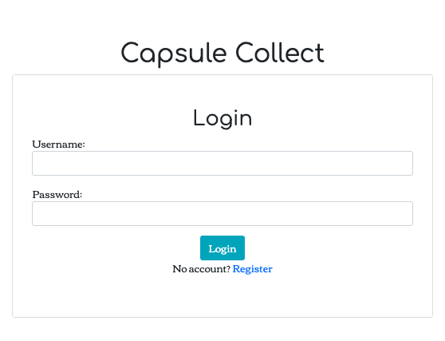
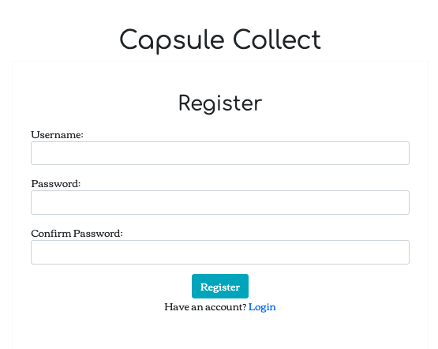
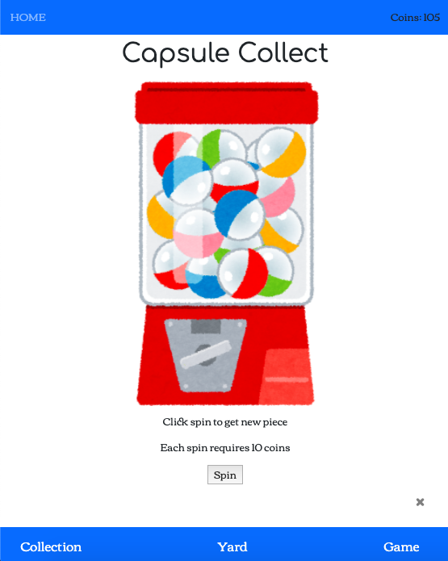
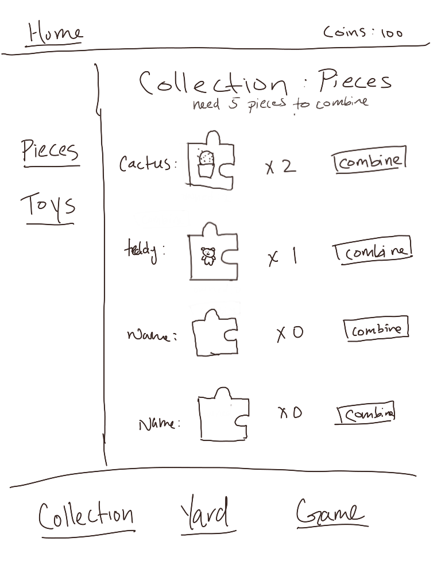
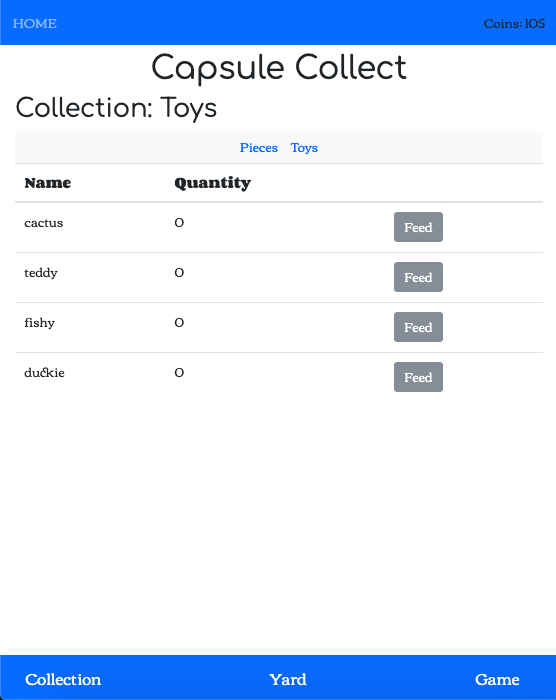
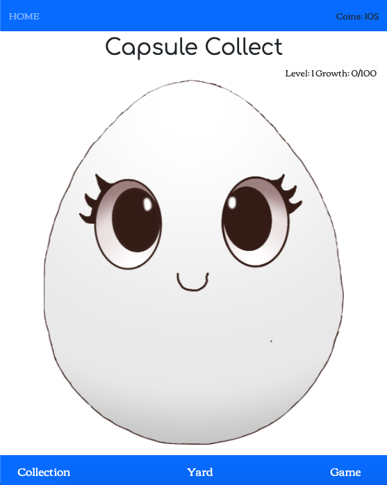
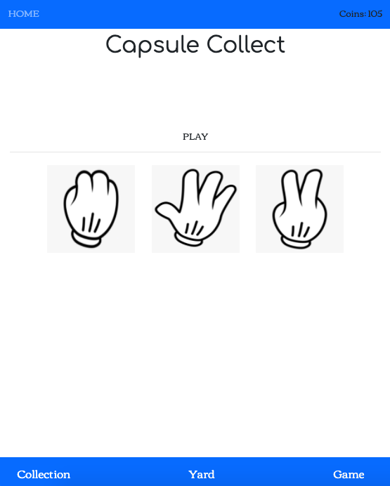
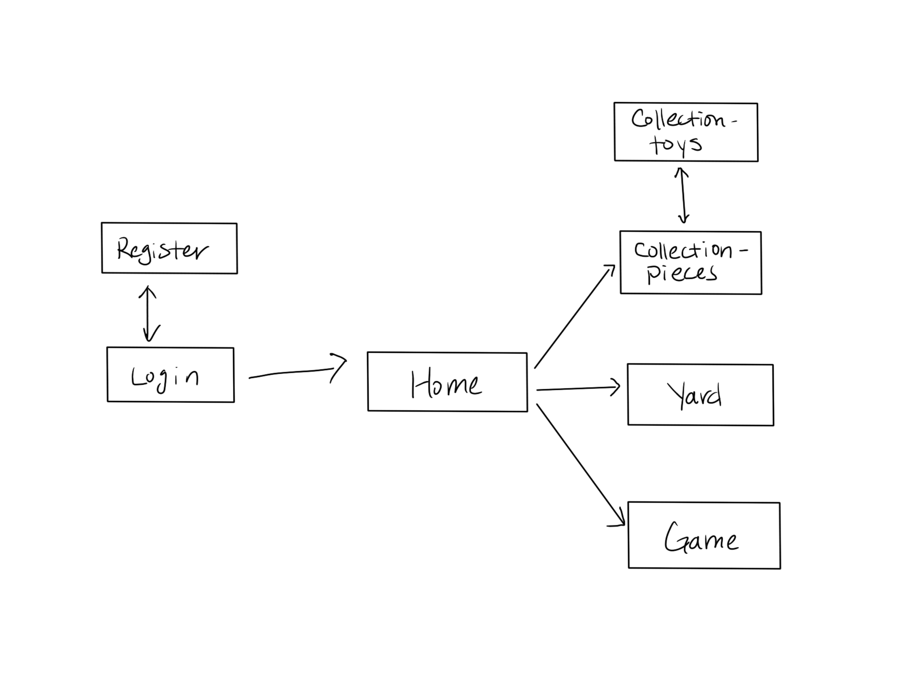

# Capsule Collect 

## Overview

Capsule Collect is a collector game where the player use coins to buy capsules that will give you a random piece of an object. The pieces can be combined into a whole toy object. Players have to register and login. The player has pets that can be fed toys to grow up. All pieces and toy objects the player owns are shown on the collections page. 
Players can play a simple game like rock-paper-scissors to earn coins. 


## Data Model

The application will store Users, Pet, Pieces, and Toy:

* users has a pet (by embedding)
* users can have multiple pieces and toys (by embedding)

An Example User with Embedded Items:

```javascript
{
username: 
hash: 
coins: 100,
pieces: [
    { name: "cactus", quantity: "5"},
    { name: "ramen", quantity: "2"},
],
toys: [
    { name: "cactus", quantity: "0"},
    { name: "ramen", quantity: "1"},
],
pets: { name: "bearwood", level: 1, growth: 50}
}
```


## [Link to Commented First Draft Schema](db.js) 

## Wireframes

/login - page to login to your account



/register - page to register for new users



/home - home page for obtaining capsule from vending machine



/collection-pieces - page for showing all pieces



/collection-toys - page for showing all toys



/yard - page for showing and feeding pet



/game - page for playing game to earn coins



## Site map



## User Stories or Use Cases

1. as non-registered user, I can register a new account with the site
2. as a user, I can log in to the site
3. as a user, I can use coins to spin the vending machine to get capsule
4. as a user, I can view all the pieces and toys obtained
5. as a user, I can combine pieces for form toys
6. as a user, I can view and feed the pet to level it up in the yard
7. as a user, I can play a game of to obtain coins

## Research Topics

* (5 points) Integrate user authentication
    * I'm going to be using passport for user authentication
* (3 points) CSS framework
    * use Bootstrap to implement to implement design framework
* (1 points) Use connect-flash library
    * use flash messages for errors that occur during login and registration


## [Link to Initial Main Project File](app.js) 

## Annotations / References Used

1. [passport.js authentication docs](http://passportjs.org/docs)
2. [tutorial on creating registration and login pages](https://www.youtube.com/watch?v=6FOq4cUdH8k)

