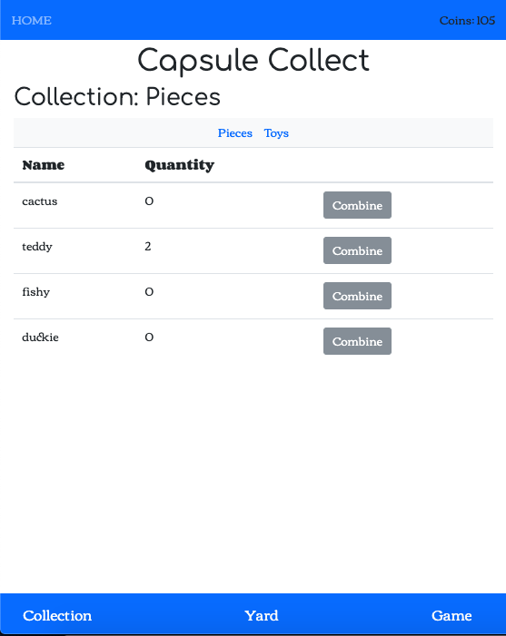

The content below is an example project proposal / requirements document. Replace the text below the lines marked "__TODO__" with details specific to your project. Remove the "TODO" lines.

(___TODO__: your project name_)

# Capsule Collect 

## Overview

(___TODO__: a brief one or two paragraph, high-level description of your project_)

Capsule Collect is a collector game where the player use coins to buy capsules that will give you a random piece of an object. The pieces can be combined into a whole toy object. Players have to register and login. The player has pets that can be fed toys to grow up. All pieces and toy objects the player owns are shown on the collections page. 
Players can play a simple game like rock-paper-scissors to earn coins. 


## Data Model

(___TODO__: a description of your application's data and their relationships to each other_) 

The application will store Users, Pet, Pieces, and Toy:

* users has a pet (by embedding)
* users can have multiple pieces and toys (by embedding)

(___TODO__: sample documents_)

An Example User with Embedded Items:

```javascript
{
username: 
hash: 
coins: 100,
pieces: [
    { name: "cactus", quantity: "5"},
    { name: "ramen", quantity: "2"},
],
toys: [
    { name: "cactus", quantity: "0"},
    { name: "ramen", quantity: "1"},
],
pets: { name: "bearwood", level: 1, growth: 50}
}
```


## [Link to Commented First Draft Schema](db.js) 

(___TODO__: create a first draft of your Schemas in db.js and link to it_)

## Wireframes

(___TODO__: wireframes for all of the pages on your site; they can be as simple as photos of drawings or you can use a tool like Balsamiq, Omnigraffle, etc._)

/ - home page for obtaining capsule from vending machine


/collection-pieces - page for showing all pieces



/collection-toys - page for showing all toys


/yard - page for showing and feeding pet


/game - page for playing game to earn coins


## Site map

(___TODO__: draw out a site map that shows how pages are related to each other_)


## User Stories or Use Cases

(___TODO__: write out how your application will be used through [user stories](http://en.wikipedia.org/wiki/User_story#Format) and / or [use cases](https://www.mongodb.com/download-center?jmp=docs&_ga=1.47552679.1838903181.1489282706#previous)_)

1. as non-registered user, I can register a new account with the site
2. as a user, I can log in to the site
3. as a user, I can use coins to spin the vending machine to get capsule
4. as a user, I can view all the pieces and toys obtained
5. as a user, I can combine pieces for form toys
6. as a user, I can view and feed the pet to level it up in the yard
7. as a user, I can play a game of to obtain coins

## Research Topics

(___TODO__: the research topics that you're planning on working on along with their point values... and the total points of research topics listed_)

* (5 points) Integrate user authentication
    * I'm going to be using passport for user authentication
* (2 points) CSS framework
    * use Bootstrap to implement to implement design framework
* (3 points) Perform client side form validation using a JavaScript library
    * if you try to feed a pet at level 5, an error message will appear

10 points total out of 8 required points (___TODO__: addtional points will __not__ count for extra credit_)


## [Link to Initial Main Project File](app.js) 

(___TODO__: create a skeleton Express application with a package.json, app.js, views folder, etc. ... and link to your initial app.js_)

## Annotations / References Used

(___TODO__: list any tutorials/references/etc. that you've based your code off of_)

1. [passport.js authentication docs](http://passportjs.org/docs) - (add link to source code that was based on this)


